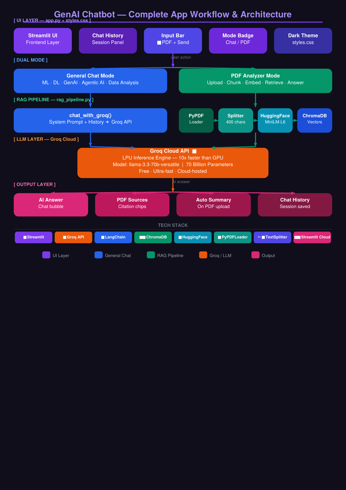

# 🤖 GenAI Chatbot with RAG Pipeline

A full-stack AI Assistant that combines a **general AI chatbot** (ML, DL, GenAI, Agentic AI) with a **PDF Analyzer** powered by Retrieval-Augmented Generation (RAG).

🔗 **Live Demo:** [Click here to try the app](https://your-app-url.streamlit.app)

---

## 🏗️ App Architecture



---

## ✨ Features

- 💬 **General AI Chat** — Ask anything about ML, DL, Generative AI, Agentic AI, Data Analysis
- 📄 **PDF Analyzer** — Upload any PDF and chat with it instantly
- 🔍 **Auto Summary** — AI automatically summarizes PDF on upload
- 🕘 **Chat History** — Sessions saved and switchable during the app session
- ⚡ **Ultra-fast responses** — Powered by Groq's LPU inference engine
- 🌑 **Dark UI** — ChatGPT-style dark theme with animated aurora background

---

## 🛠️ Tech Stack

| Layer | Technology |
|---|---|
| **Frontend** | Streamlit |
| **LLM** | Groq API — llama-3.3-70b-versatile |
| **RAG Framework** | LangChain |
| **Embeddings** | HuggingFace — all-MiniLM-L6-v2 |
| **Vector Database** | ChromaDB |
| **PDF Loader** | PyPDFLoader |
| **Text Splitter** | RecursiveCharacterTextSplitter |
| **Deployment** | Streamlit Cloud |

---

## 🚀 How to Run Locally

### 1. Clone the repository
```bash
git clone https://github.com/Annu2727/rag-chatbot.git
cd rag-chatbot
```

### 2. Install dependencies
```bash
pip install -r requirements.txt
```

### 3. Add your Groq API key
Create a file at `.streamlit/secrets.toml`:
```toml
GROQ_API_KEY = "your_groq_api_key_here"
```
Get a free API key at [console.groq.com](https://console.groq.com)

### 4. Run the app
```bash
streamlit run app.py
```

---

## 📁 Project Structure

```
rag-chatbot/
├── app.py              # Streamlit UI + session management
├── rag_pipeline.py     # RAG logic (load, chunk, embed, retrieve)
├── styles.css          # Dark theme styling
├── requirements.txt    # Python dependencies
└── README.md           # Project documentation
```

---

## 🔄 How RAG Works

```
PDF Uploaded
    ↓
PyPDFLoader reads pages
    ↓
RecursiveCharacterTextSplitter → chunks (400 chars)
    ↓
HuggingFace Embeddings → vectors (384 dimensions)
    ↓
ChromaDB stores vectors
    ↓
User asks question → question converted to vector
    ↓
ChromaDB similarity search → Top-5 matching chunks
    ↓
Chunks + Question sent to Groq (Llama 3.3 70B)
    ↓
AI generates accurate, source-cited answer
```

---

## 📝 Resume Bullet Points

- **Developed** a full-stack GenAI chatbot using Groq (Llama 3.3 70B), LangChain, ChromaDB, HuggingFace sentence-transformers, and Streamlit — deployed live on Streamlit Cloud with API keys secured via Streamlit Secrets.

- **Implemented** dual-mode functionality where users can have general AI conversations covering ML, DL, Generative AI, and Agentic AI topics with session-based chat history, and seamlessly switch to PDF analysis mode by uploading documents.

- **Designed** a complete RAG pipeline that chunks uploaded PDFs into overlapping text segments, converts them into semantic vectors stored in ChromaDB, retrieves the most relevant chunks via similarity search, and passes them as context to the LLM — enabling accurate, source-cited answers from any uploaded document.

---

## 👩‍💻 Author

**Annu Chhaperwal**
- GitHub: [@Annu2727](https://github.com/Annu2727)

---

## 📄 License

This project is open source and available under the [MIT License](LICENSE).
